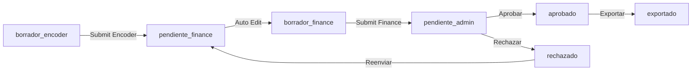

# TEST-FLUJO-E2E.md - Guía de Testing End-to-End del Workflow Completo

**Última actualización:** 4 de Noviembre, 2025 (21:00 hrs)  
**Versión:** 1.0  
**Estado:** Bloques 1-7 completados ✅ - Listo para testing manual

---

## 📋 Índice

1. [Resumen Ejecutivo](#resumen-ejecutivo)
2. [Supuestos y Pre-requisitos](#supuestos-y-pre-requisitos)
3. [Arquitectura del Workflow](#arquitectura-del-workflow)
4. [Flujo 1: Aprobación Exitosa (Happy Path)](#flujo-1-aprobación-exitosa-happy-path)
5. [Flujo 2: Rechazo y Corrección](#flujo-2-rechazo-y-corrección)
6. [Checklist de Validaciones](#checklist-de-validaciones)
7. [Troubleshooting](#troubleshooting)

---

## 🎯 Resumen Ejecutivo

### ¿Qué se implementó?

Se completó el **workflow colaborativo end-to-end** para procesamiento de archivos GRD con 3 roles:

1. **Encoder:** Sube archivo SIGESA y edita Ajustes Tecnológicos (AT)
2. **Finance:** Agrega datos financieros complementarios
3. **Admin:** Revisa, aprueba/rechaza y exporta archivo final

### Estados del Workflow (7 estados)



### Regla Crítica: Archivo Único

⚠️ **RESTRICCIÓN IMPORTANTE:** Solo puede existir **UN archivo en proceso** a la vez.

- **Estados que bloquean carga:** `borrador_encoder`, `pendiente_finance`, `borrador_finance`, `pendiente_admin`, `rechazado`
- **Estado que libera el sistema:** `exportado`
- **Validación:** Se verifica antes de subir nuevo archivo

### Bloques Implementados (7/8)

| Bloque | Descripción | Estado | Fecha Completado |
|--------|-------------|--------|------------------|
| BLOQUE 1 | Migración estado 'rechazado' | ✅ | 3/nov/2025 |
| BLOQUE 2 | API validar archivo único | ✅ | 3/nov/2025 |
| BLOQUE 3 | API Review (Aprobar/Rechazar) | ✅ | 4/nov/2025 |
| BLOQUE 4 | Botón Submit Encoder | ✅ | 4/nov/2025 |
| BLOQUE 5 | Botón Submit Finance | ✅ | 4/nov/2025 |
| BLOQUE 6 | Botones Admin (Aprobar/Rechazar) | ✅ | 4/nov/2025 |
| BLOQUE 7 | Integración con /visualizator | ✅ | 4/nov/2025 |
| BLOQUE 8 | Testing Manual E2E | ⏳ | Pendiente |

---

## 🔧 Supuestos y Pre-requisitos

### 1. Base de Datos

**Estado actual:**

- ✅ Tabla `grd_fila` con campo `estado` (tipo ENUM `workflow_estado`)
- ✅ 7 estados disponibles: `borrador_encoder`, `pendiente_finance`, `borrador_finance`, `pendiente_admin`, `aprobado`, `exportado`, `rechazado`
- ✅ RLS policies configuradas por rol
- ✅ Índices para optimización de queries por estado

**Verificar:**

```sql
-- Ver estados disponibles
SELECT unnest(enum_range(NULL::workflow_estado));

-- Verificar que no hay archivos en proceso
SELECT id_grd_oficial, estado, COUNT(*) 
FROM grd_fila 
WHERE estado IN ('borrador_encoder', 'pendiente_finance', 'borrador_finance', 'pendiente_admin', 'rechazado')
GROUP BY id_grd_oficial, estado;
```

### 2. Usuarios de Testing

**Usuarios requeridos:**

| Email | Password | Rol | Propósito |
|-------|----------|-----|-----------|
| <admin@test.com> | Admin123! | admin | Aprobar/Rechazar archivos |
| <encoder@test.com> | Encoder123! | encoder | Subir y editar AT |
| <finance@test.com> | Finance123! | finance | Agregar datos financieros |

**Verificar usuarios:**

```sql
SELECT email, role, is_active FROM users WHERE email LIKE '%@test.com';
```

### 3. Archivo Excel de Prueba

**Requisitos del archivo SIGESA:**

- Formato: `.xlsx`
- Estructura: Mínimo 83 columnas (formato SIGESA oficial)
- Columnas críticas: `episodio_CMBD`, `IR-GRD`, `peso`, `fecha_ingreso`, `fecha_alta`
- Tamaño recomendado: 10-50 filas para testing

**Ubicación:** `/root/uc/DataUnion/Archivos/archivo-inicial/`

### 4. Validaciones Temporalmente Deshabilitadas

✅ **ACTUALIZADO 5/Nov/2025:** Validaciones re-habilitadas (TECH-006 completado)

**Archivo:** `src/app/api/v1/grd/[grdId]/submit-finance/route.ts`

**Validación activa:**

- Campo `validado` es OBLIGATORIO en TODAS las filas
- Finance NO puede hacer Submit si hay filas sin completar
- Validación muestra episodios afectados y contador total

**Para testing:**

- Asegurarse de completar campo `validado` en todas las filas
- Valores aceptados: Cualquier string no vacío (ej: "Sí", "No")
- Si falta alguna fila: Error descriptivo con episodios

**Ver documentación completa:** `docs/TECH-006_VALIDATION_TEST.md`

---

## 🏗️ Arquitectura del Workflow

### Permisos por Rol

#### **Encoder**

- **Acceso:** `/upload`, `/visualizator`, `/sigesa` (lectura), `/norma` (lectura)
- **Estados visibles:** `borrador_encoder`, `rechazado`
- **Campos editables:** `at` (boolean), `at_detalle` (multi-select dropdown)
- **Campos bloqueados:** Todos los demás (83 columnas SIGESA + campos Finance)
- **Acciones:**
  - ✅ Subir archivo Excel (si no hay archivo en flujo)
  - ✅ Editar AT en filas
  - ✅ Guardar cambios (auto-guardado cada 5s)
  - ✅ Submit → Finance (doble confirmación)
  - ✅ Reenviar si Admin rechaza

#### **Finance**

- **Acceso:** `/visualizator`, `/sigesa` (lectura)
- **Estados visibles:** `pendiente_finance`, `borrador_finance`
- **Campos editables:** `validado`, `n_folio`, `estado_rn`, `monto_rn`, `documentacion`
- **Campos bloqueados:** Todos los de SIGESA + AT (encoder)
- **Acciones:**
  - ✅ Recibe notificación cuando Encoder entrega
  - ✅ Editar campos financieros en filas
  - ✅ Guardar cambios (auto-guardado cada 5s)
  - ✅ Submit → Admin (doble confirmación)
  - ❌ Pierde acceso si Admin rechaza

#### **Admin**

- **Acceso:** `/dashboard/users`, `/visualizator`, `/sigesa` (lectura)
- **Estados visibles:** `pendiente_admin`, `aprobado`, `exportado`
- **Campos editables:** **NINGUNO** (modo lectura total)
- **Campos bloqueados:** TODOS (visualización únicamente)
- **Acciones:**
  - ✅ Recibe notificación cuando Finance entrega
  - ✅ Visualizar todos los datos (modo lectura)
  - ✅ Aprobar archivo → estado `aprobado`
  - ✅ Rechazar archivo → estado `rechazado` (vuelve a Encoder)
  - ✅ Exportar archivo aprobado → estado `exportado`
  - ✅ Re-descargar archivos exportados

### Transiciones de Estado

| Estado Actual | Acción | Rol | Estado Nuevo |
|--------------|--------|-----|--------------|
| `borrador_encoder` | Submit | Encoder | `pendiente_finance` |
| `pendiente_finance` | Primera edición | Finance | `borrador_finance` |
| `borrador_finance` | Submit | Finance | `pendiente_admin` |
| `pendiente_admin` | Aprobar | Admin | `aprobado` |
| `aprobado` | Exportar | Admin | `exportado` |
| `pendiente_admin` | Rechazar | Admin | `rechazado` |
| `rechazado` | Reenviar | Encoder | `pendiente_finance` |

---

## ✅ Flujo 1: Aprobación Exitosa (Happy Path)

### PASO 1: Encoder sube archivo 📤

**Usuario:** <encoder@test.com>  
**Objetivo:** Subir archivo SIGESA y crear nuevo GRD

#### Acciones

1. **Login como Encoder**

    ```plaintext
    URL: http://localhost:3000/login
    Email: encoder@test.com
    Password: Encoder123!
    ```

2. **Navegar a Upload**

  ```plaintext
  URL: http://localhost:3000/upload
  ```

3. **Verificar validación de archivo único**

   - Si hay archivo en proceso: Error "Ya existe un archivo en proceso"
   - Si no hay archivo: Permitir carga

4. **Subir archivo Excel**
   - Drag & drop o seleccionar archivo
   - Esperar parsing (puede tomar 10-30 segundos)

#### Resultado Esperado

- ✅ Alert: "Archivo subido exitosamente"
- ✅ Redirección a `/dashboard`
- ✅ En base de datos:

  ```sql
  SELECT id_grd_oficial, estado FROM grd_fila LIMIT 1;
  -- Resultado: estado = 'borrador_encoder'
  ```

---

### PASO 2: Encoder edita AT y entrega ✏️

**Usuario:** <encoder@test.com>  
**Objetivo:** Editar Ajustes Tecnológicos y entregar a Finance

#### Acciones

1. **Navegar a Visualizator**

   ```plaintext
   URL: http://localhost:3000/visualizator
   ```

2. **Verificar permisos de edición**
   - ✅ Campos editables: `at`, `at_detalle` (sin candado 🔒)
   - ✅ Campos bloqueados: Todos los demás (con candado 🔒)

3. **Editar filas**
   - Cambiar `at` a "Sí" en algunas filas
   - Click en `at_detalle` → Abre modal multi-select
   - Seleccionar ajustes tecnológicos (ej: "AT001 - Marcapasos")
   - Click "Aplicar"
   - Ver cálculo automático de `monto_at`

4. **Guardar cambios**
   - Click "💾 Guardar cambios (X)"
   - Esperar confirmación
   - Verificar: Contador de cambios = 0

5. **Entregar a Finance**
   - Click "✅ Entregar a Finanzas"
   - Se abre modal de confirmación:
     - Título: "Confirmar Entrega a Finanzas"
     - Advertencia: "No podrás editar después de enviar"
     - Lista de verificación
   - Click "✅ Confirmar Entrega"

#### Resultado Esperado

- ✅ Alert: "Archivo entregado a Finanzas exitosamente"
- ✅ Redirección a `/dashboard`
- ✅ En base de datos:

  ```sql
  SELECT estado FROM grd_fila WHERE id_grd_oficial = [ID];
  -- Resultado: estado = 'pendiente_finance'
  ```

- ✅ Encoder pierde acceso al archivo (ya no lo ve en `/visualizator`)

---

### PASO 3: Finance edita datos financieros y entrega 💼

**Usuario:** <finance@test.com>  
**Objetivo:** Agregar información financiera y entregar a Admin

#### Acciones

1. **Logout Encoder y Login Finance**

   ```
   Email: finance@test.com
   Password: Finance123!
   ```

2. **Verificar notificación en Dashboard**
   - ✅ Banner: "🔔 Tienes archivo pendiente"

3. **Navegar a Visualizator**

   ```
   URL: http://localhost:3000/visualizator
   ```

4. **Verificar permisos de edición**
   - ✅ Campos editables: `validado`, `n_folio`, `estado_rn`, `monto_rn`, `documentacion`
   - ✅ Campos bloqueados: AT (encoder) + todos los de SIGESA (con candado 🔒)

5. **Editar filas**
   - Cambiar `validado` a "Sí"
   - Agregar `n_folio` (ej: 12345)
   - Agregar `monto_rn` (ej: 50000)

6. **Guardar cambios**
   - Click "💾 Guardar cambios (X)"
   - **Nota:** Estado cambia automáticamente a `borrador_finance`

7. **Entregar a Admin**
   - Click "📊 Entregar a Administración"
   - Se abre modal de confirmación
   - Click "✅ Confirmar Entrega"

#### Resultado Esperado

- ✅ Alert: "Archivo entregado a Administración exitosamente"
- ✅ Redirección a `/dashboard`
- ✅ En base de datos:

  ```sql
  SELECT estado FROM grd_fila WHERE id_grd_oficial = [ID];
  -- Resultado: estado = 'pendiente_admin'
  ```

- ✅ Finance pierde acceso al archivo

---

### PASO 4: Admin aprueba y exporta ✅

**Usuario:** <admin@test.com>  
**Objetivo:** Revisar, aprobar y exportar archivo final

#### Acciones

1. **Logout Finance y Login Admin**

   ```
   Email: admin@test.com
   Password: Admin123!
   ```

2. **Verificar notificación en Dashboard**
   - ✅ Banner: "🔔 Tienes archivo pendiente de aprobación"

3. **Navegar a Visualizator**

   ```
   URL: http://localhost:3000/visualizator
   ```

4. **Verificar modo lectura**
   - ✅ TODOS los campos bloqueados (con candado 🔒)
   - ✅ Admin NO puede editar nada
   - ✅ Aparecen botones:
     - "✅ Aprobar Archivo" (verde)
     - "❌ Rechazar Archivo" (rojo)

5. **Revisar datos**
   - Verificar campos de Encoder (AT)
   - Verificar campos de Finance (validado, folio, etc.)

6. **Aprobar archivo**
   - Click "✅ Aprobar Archivo"
   - Esperar loading state

#### Resultado Esperado

- ✅ Alert: "Archivo aprobado exitosamente. Ahora puedes exportarlo."
- ✅ Redirección a `/dashboard`
- ✅ En base de datos:

  ```sql
  SELECT estado FROM grd_fila WHERE id_grd_oficial = [ID];
  -- Resultado: estado = 'aprobado'
  ```

7. **Exportar archivo (Opcional)**
   - Volver a `/visualizator`
   - Click "Descargar Excel"
   - Se descarga archivo con formato FONASA

---

## 🔁 Flujo 2: Rechazo y Corrección

### PASO 1-3: Repetir hasta Finance entrega

Seguir **Flujo 1** pasos 1-3 hasta que archivo esté en `pendiente_admin`.

---

### PASO 4: Admin rechaza archivo ❌

**Usuario:** <admin@test.com>  
**Objetivo:** Rechazar archivo con razón y devolver a Encoder

#### Acciones

1. **Navegar a Visualizator**

   ```
   URL: http://localhost:3000/visualizator
   Estado actual: pendiente_admin
   ```

2. **Click "❌ Rechazar Archivo"**
   - Se abre modal "Rechazar Archivo"

3. **Verificar validaciones del modal**
   - ❌ Campo vacío → Botón deshabilitado
   - ❌ Menos de 10 caracteres → Error: "La razón debe tener al menos 10 caracteres"

4. **Escribir razón válida**

   ```
   Ejemplo: "Faltan datos en episodios 1234, 5678. Por favor completar campo AT_detalle antes de reenviar."
   ```

5. **Confirmar rechazo**
   - Click "❌ Rechazar Archivo" (botón del modal)
   - Esperar loading state

#### Resultado Esperado

- ✅ Alert: "Archivo rechazado. El Encoder ha sido notificado."
- ✅ Redirección a `/dashboard`
- ✅ En base de datos:

  ```sql
  SELECT estado FROM grd_fila WHERE id_grd_oficial = [ID];
  -- Resultado: estado = 'rechazado'
  ```

---

### PASO 5: Encoder corrige y reenvía 🔄

**Usuario:** <encoder@test.com>  
**Objetivo:** Ver razón de rechazo, corregir y reenviar

#### Acciones

1. **Login como Encoder**

   ```
   Email: encoder@test.com
   Password: Encoder123!
   ```

2. **Navegar a Visualizator**

   ```
   URL: http://localhost:3000/visualizator
   ```

3. **Verificar alerta de rechazo**
   - ✅ Alerta roja en la parte superior:

     ```
     ⚠️ Archivo Rechazado por el Administrador
     Este archivo fue rechazado. Por favor revisa los comentarios del 
     administrador, realiza las correcciones necesarias y vuelve a enviarlo.
     ```

   - ✅ Estado muestra: "rechazado"

4. **Verificar permisos de edición**
   - ✅ Campos editables de nuevo: `at`, `at_detalle`
   - ✅ Funciona igual que estado `borrador_encoder`

5. **Corregir datos según comentario admin**
   - Completar campos faltantes mencionados en razón
   - Verificar episodios específicos

6. **Guardar cambios**
   - Click "💾 Guardar cambios (X)"

7. **Reenviar a Finance**
   - Click "✅ Reenviar a Finanzas" (texto cambia a "Reenviar")
   - Confirmar en modal

#### Resultado Esperado

- ✅ Alert: "Archivo entregado a Finanzas exitosamente"
- ✅ Redirección a `/dashboard`
- ✅ En base de datos:

  ```sql
  SELECT estado FROM grd_fila WHERE id_grd_oficial = [ID];
  -- Resultado: estado = 'pendiente_finance'
  ```

---

### PASO 6: Finance y Admin aprueban

Repetir **Flujo 1** pasos 3-4 para completar el ciclo de corrección.

---

## ✅ Checklist de Validaciones

### Validaciones de Acceso

- [ ] **Encoder NO puede ver archivos en:**
  - `pendiente_finance`
  - `borrador_finance`
  - `pendiente_admin`
  - `aprobado`
  - `exportado`

- [ ] **Finance NO puede ver archivos en:**
  - `borrador_encoder`
  - `rechazado`
  - `pendiente_admin`
  - `aprobado`
  - `exportado`

- [ ] **Admin NO puede ver archivos en:**
  - `borrador_encoder`
  - `rechazado`
  - `pendiente_finance`
  - `borrador_finance`

- [ ] **Encoder SÍ puede ver archivos en:**
  - `borrador_encoder`
  - `rechazado` (para corregir)

### Validaciones de Edición

- [ ] **Encoder solo edita:**
  - `at` (boolean)
  - `at_detalle` (dropdown multi-select)
  - **En estados:** `borrador_encoder`, `rechazado`

- [ ] **Finance solo edita:**
  - `validado` (Sí/No)
  - `n_folio` (número)
  - `estado_rn` (texto)
  - `monto_rn` (número)
  - `documentacion` (texto)
  - **En estados:** `pendiente_finance`, `borrador_finance`

- [ ] **Admin NO edita ningún campo:**
  - Todos los campos con candado 🔒
  - **En estados:** `pendiente_admin`, `aprobado`, `exportado`

- [ ] **Campos SIGESA SIEMPRE bloqueados:**
  - 83 columnas originales de SIGESA
  - Para TODOS los roles

### Validaciones de Botones

- [ ] **Encoder: "Entregar a Finanzas"**
  - Solo visible si: `estado = 'borrador_encoder' OR 'rechazado'`
  - Solo habilitado si: NO hay cambios sin guardar
  - Texto: "Entregar" o "Reenviar" según estado

- [ ] **Finance: "Entregar a Administración"**
  - Solo visible si: `estado = 'pendiente_finance' OR 'borrador_finance'`
  - Solo habilitado si: NO hay cambios sin guardar

- [ ] **Admin: "Aprobar Archivo"**
  - Solo visible si: `estado = 'pendiente_admin'`
  - Siempre habilitado

- [ ] **Admin: "Rechazar Archivo"**
  - Solo visible si: `estado = 'pendiente_admin'`
  - Siempre habilitado
  - Abre modal con validación de razón

### Validaciones de Estado

- [ ] **Transición: borrador_encoder → pendiente_finance**
  - Acción: Submit Encoder
  - Validación: NO hay cambios sin guardar

- [ ] **Transición: pendiente_finance → borrador_finance**
  - Acción: Primera edición de Finance
  - Automático

- [ ] **Transición: borrador_finance → pendiente_admin**
  - Acción: Submit Finance
  - Validación: NO hay cambios sin guardar

- [ ] **Transición: pendiente_admin → aprobado**
  - Acción: Aprobar Admin
  - Sin validaciones adicionales

- [ ] **Transición: pendiente_admin → rechazado**
  - Acción: Rechazar Admin
  - Validación: Razón >= 10 caracteres

- [ ] **Transición: rechazado → pendiente_finance**
  - Acción: Reenviar Encoder
  - Validación: NO hay cambios sin guardar

### Validaciones de Archivo Único

- [ ] **Antes de subir nuevo archivo:**
  - Query verifica existencia de archivo en flujo
  - Estados bloqueantes: `borrador_encoder`, `pendiente_finance`, `borrador_finance`, `pendiente_admin`, `rechazado`
  - Estado liberador: `exportado`

- [ ] **Error si archivo en proceso:**
  - Mensaje: "Ya existe un archivo en proceso de codificación"
  - No permite carga

### Validaciones de Modal Submit

- [ ] **SubmitConfirmModal para Encoder:**
  - Título: "Confirmar Entrega a Finanzas"
  - Checklist de 4 items
  - Advertencia: "No podrás editar después"
  - Botones: Cancelar / Confirmar

- [ ] **SubmitConfirmModal para Finance:**
  - Título: "Confirmar Entrega a Administración"
  - Checklist de 4 items
  - Advertencia: "No podrás editar después"
  - Botones: Cancelar / Confirmar

### Validaciones de Modal Rechazar

- [ ] **RejectModal para Admin:**
  - Título: "Rechazar Archivo"
  - Campo de texto: razón obligatoria
  - Validación mínimo: 10 caracteres
  - Placeholder con ejemplo
  - Advertencia: "Volverá a borrador_encoder"
  - Botones: Cancelar / Rechazar
  - Contador de caracteres

### Validaciones UI

- [ ] **Indicador de cambios sin guardar:**
  - Muestra: "⚠️ Tienes X cambio(s) sin guardar"
  - Color: Naranja
  - Ubicación: Parte superior del editor

- [ ] **Loading states:**
  - Guardar: "⌛ Guardando..."
  - Submit Encoder: "⌛ Entregando..."
  - Submit Finance: "⌛ Entregando..."
  - Aprobar: "⌛ Aprobando..."
  - Rechazar: "⌛ Rechazando..."

- [ ] **Mensajes de error:**
  - Fondo rojo claro
  - Borde rojo
  - Icono: ❌
  - Texto descriptivo del error

- [ ] **Alerta de archivo rechazado:**
  - Fondo rojo claro
  - Borde rojo (izquierda)
  - Icono: ⚠️
  - Título: "Archivo Rechazado por el Administrador"
  - Descripción clara de próximos pasos

---

## 🔧 Troubleshooting

### Problema 1: "No hay archivo en proceso" en Visualizator

**Síntoma:** Mensaje de error al entrar a `/visualizator`

**Causas posibles:**

1. No se ha subido ningún archivo
2. Archivo está en estado no permitido para el rol
3. Archivo fue exportado (estado `exportado`)

**Solución:**

```sql
-- Ver estado actual del archivo
SELECT id_grd_oficial, estado FROM grd_fila ORDER BY id DESC LIMIT 1;

-- Si está en estado no permitido, ajustar manualmente (solo testing)
UPDATE grd_fila SET estado = 'borrador_encoder' WHERE id_grd_oficial = [ID];
```

---

### Problema 2: "Ya existe un archivo en proceso"

**Síntoma:** Error al intentar subir nuevo archivo en `/upload`

**Causas posibles:**

1. Hay un archivo en estado activo
2. Archivo anterior no fue exportado ni rechazado

**Solución:**

```sql
-- Ver archivo en proceso
SELECT id_grd_oficial, estado, COUNT(*) 
FROM grd_fila 
WHERE estado IN ('borrador_encoder', 'pendiente_finance', 'borrador_finance', 'pendiente_admin', 'rechazado')
GROUP BY id_grd_oficial, estado;

-- Forzar cambio a exportado (solo testing)
UPDATE grd_fila SET estado = 'exportado' WHERE id_grd_oficial = [ID];
```

---

### Problema 3: Botones Submit no aparecen

**Síntoma:** No se ven los botones "Entregar a Finanzas" o "Entregar a Administración"

**Causas posibles:**

1. Hay cambios sin guardar (contador > 0)
2. Estado del archivo no es el correcto
3. Rol del usuario no coincide

**Solución:**

1. Verificar contador de cambios (debe ser 0)
2. Click "💾 Guardar cambios" primero
3. Verificar estado en DB:

   ```sql
   SELECT estado FROM grd_fila WHERE id_grd_oficial = [ID];
   ```

4. Verificar rol del usuario:

   ```sql
   SELECT email, role FROM users WHERE email = 'encoder@test.com';
   ```

---

### Problema 4: Campos no editables (todos con candado)

**Síntoma:** Todos los campos aparecen bloqueados con 🔒

**Causas posibles:**

1. Estado del archivo no permite edición para ese rol
2. Archivo ya fue enviado (estado avanzó)

**Solución:**

1. Verificar estado del archivo
2. Encoder: debe estar en `borrador_encoder` o `rechazado`
3. Finance: debe estar en `pendiente_finance` o `borrador_finance`
4. Admin: NUNCA edita (comportamiento esperado)

---

### Problema 5: Error "Debes completar el campo validado"

**Síntoma:** Finance no puede hacer Submit

**Causa:** Validación de campos obligatorios está activa

**Solución temporal (solo testing):**
Las validaciones están comentadas en:

```
src/app/api/v1/grd/[grdId]/submit-finance/route.ts
Líneas 102-110
```

Si están descomentadas, completar el campo `validado` en todas las filas.

---

### Problema 6: Modal de rechazo no valida razón

**Síntoma:** Botón "Rechazar" siempre deshabilitado

**Causas posibles:**

1. Razón tiene menos de 10 caracteres
2. Campo está vacío

**Solución:**

- Escribir al menos 10 caracteres en el campo de razón
- Ejemplo válido: "Faltan datos en AT de episodio 1234"

---

### Problema 7: Alerta de rechazo no aparece

**Síntoma:** Encoder no ve alerta roja después de rechazo

**Causas posibles:**

1. Estado no es `rechazado`
2. Cache del navegador

**Solución:**

1. Verificar estado:

   ```sql
   SELECT estado FROM grd_fila WHERE id_grd_oficial = [ID];
   ```

2. Refrescar página (Ctrl+F5)
3. Verificar en `/visualizator` con login de encoder

---

## 📊 Queries Útiles para Testing

### Ver estado actual del workflow

```sql
SELECT 
  gf.id_grd_oficial,
  gf.estado,
  COUNT(*) as total_filas,
  MIN(gf.episodio) as primer_episodio,
  MAX(gf.episodio) as ultimo_episodio
FROM grd_fila gf
GROUP BY gf.id_grd_oficial, gf.estado
ORDER BY gf.id_grd_oficial DESC;
```

### Ver distribución de estados

```sql
SELECT 
  estado,
  COUNT(DISTINCT id_grd_oficial) as archivos,
  COUNT(*) as filas_totales
FROM grd_fila
GROUP BY estado
ORDER BY 
  CASE estado
    WHEN 'borrador_encoder' THEN 1
    WHEN 'pendiente_finance' THEN 2
    WHEN 'borrador_finance' THEN 3
    WHEN 'pendiente_admin' THEN 4
    WHEN 'aprobado' THEN 5
    WHEN 'exportado' THEN 6
    WHEN 'rechazado' THEN 7
  END;
```

### Limpiar base de datos para nuevo test

```sql
-- ⚠️ SOLO PARA TESTING - ELIMINA TODOS LOS DATOS
DELETE FROM grd_fila;
DELETE FROM sigesa_fila;
DELETE FROM grd_oficial;
DELETE FROM sigesa;
```

### Forzar estado para testing específico

```sql
-- Forzar a pendiente_admin para testear Admin
UPDATE grd_fila 
SET estado = 'pendiente_admin' 
WHERE id_grd_oficial = [ID];

-- Forzar a rechazado para testear corrección
UPDATE grd_fila 
SET estado = 'rechazado' 
WHERE id_grd_oficial = [ID];
```

---

## 📝 Notas Finales

### Próximos Pasos

1. **Completar BLOQUE 8:** Testing manual E2E completo
2. ✅ **Re-habilitar validaciones:** TECH-006 (campos obligatorios) - **COMPLETADO 5/nov/2025**
3. **Testing de carga:** Subir archivo con 100+ filas
4. **Testing de performance:** Medir tiempo de guardado masivo
5. **Testing de concurrencia:** 2 usuarios editando simultáneamente

### Limitaciones Conocidas

1. **Validaciones temporalmente deshabilitadas:** Finance no requiere campo `validado`
2. **Sin sistema de notificaciones real:** Solo banners en dashboard
3. **Sin logs de auditoría:** No se registra quién rechazó y cuándo
4. **Sin manejo de concurrencia:** Dos usuarios pueden editar la misma fila

### Mejoras Futuras

1. Sistema de notificaciones por email
2. Logs de auditoría completos
3. Validación de campos obligatorios configurable
4. Bloqueo de filas por usuario editando
5. Historial de cambios por fila
6. Dashboard con métricas de workflow
7. Exportación automática a FONASA

---

**Documento creado por:** Joaquín Peralta  
**Última revisión:** 4 de Noviembre, 2025 (21:00 hrs)  
**Versión:** 1.0  
**Estado:** Listo para testing manual

---

## 📞 Contacto y Soporte

Para dudas o problemas durante el testing:

1. **Revisar este documento:** Sección Troubleshooting
2. **Verificar base de datos:** Usar queries de diagnóstico
3. **Revisar commits recientes:** Buscar cambios en archivos específicos
4. **Contactar al equipo:** Joaquín Peralta (responsable HU-03)

---

**FIN DEL DOCUMENTO**
